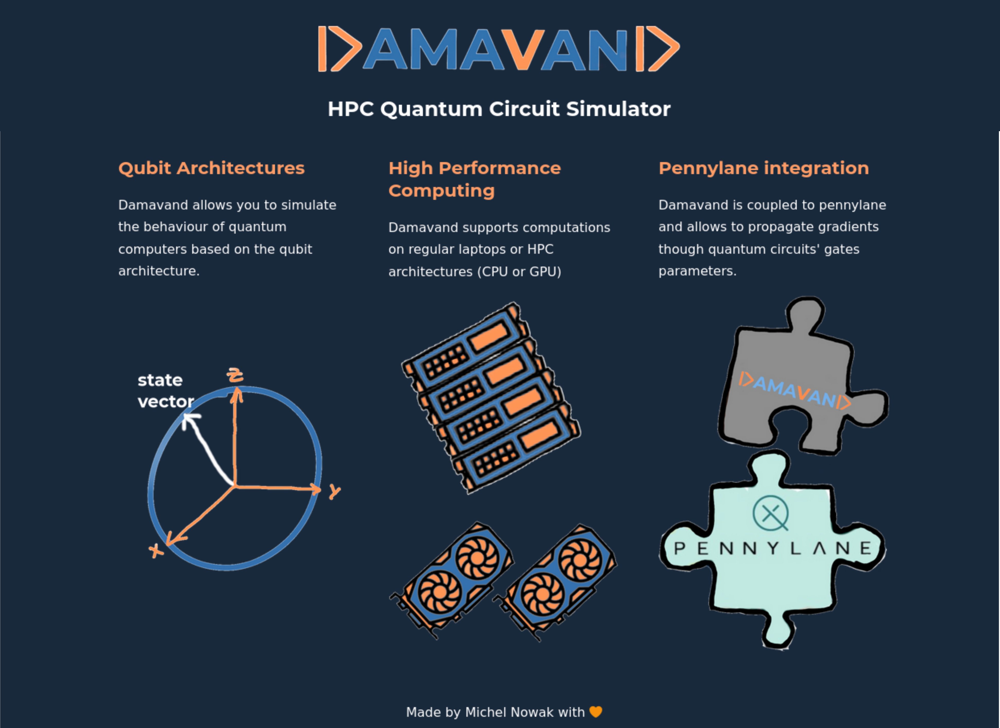
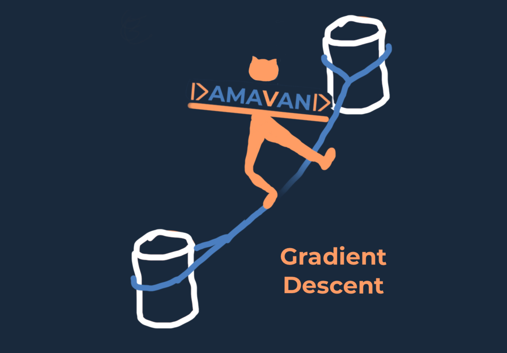

<p align="center">
  
</p>

Damavand is a code that simulates quantum circuits.
In order to learn more about damavand, refer to the [documentation](https://michelnowak1.github.io/damavand/).

## Development status

1. Core features:
  * single node CPU ✔️
  * single node GPU ✔️
  * multiple nodes CPU ✔️
  * single node multiple GPUs ✔️
  * multiple nodes multiple GPUs ✔️
2. Documentation 🛠️ (under construction) 
3. README.md 🛠️ (under construction) 
4. pypi 🛠️ (under construction) 

## Installation

### From pypi
```bash
pip3 install damavand
```

### From sources

```bash
git clone https://github.com/MichelNowak1/damavand.git
cd damavand/
python3 setup.py install
```

## Example
Damavand can be executed with different "apply methods". These refer to the algorithms used to update a quantum state by
applying a given quantum gate. The different apply methods are:

1. `brute_force` brute matrix vector multiplication (requires a lot of memory).
2. `shuffle` smart implementation of matrix vector multiplication where the matrix is the result of a series of
   kronecker products (requires less memory but is still a bit slow).
3. `"multithreading"` runs on a single node multi CPUs.
4. `"gpu"` runs on a single node single GPU.
5. `"distributed_cpu"` runs on a multiple nodes multiple CPUs.
6. `"distributed_gpu"` runs on a single node multiple GPUs or on multiple nodes multiple GPUs.

The default `"apply_method"` is `"multithreading"`. this can be changes by providing it as an option to the Circuit
builder, as shown in the following example:

```python
from damavand import Circuit

# initialize MPI
from mpi4py import MPI

num_qubits = 1
circuit = Circuit(num_qubits, apply_method="distributed_gpu")

circuit.add_hadamard_gate(0)

circuit.forward()
circuit.measure()

num_samples=10
circuit.sample(num_samples)
```

## Slurm workload run:

Here is a simple slurm example that shows how to run a simulation on 2 nodes, with multithreading.

```bash
#!/bin/bash

#SBATCH --job-name=two_nodes
#SBATCH --qos=qos_cpu-dev
#SBATCH --ntasks=2
#SBATCH --ntasks-per-node=1
#SBATCH --cpus-per-task=40
#SBATCH --output=two_nodes.listing
#SBATCH --time=5:00

module purge

module load openmpi/3.1.4
module load cuda/10.2

srun python3 two_nodes.py
```
Run `sbatch run.sh` to lounch the script

## Pennylane Integration

Damavand is linked to pennylane [PennyLane](https://pennylane.ai/), a library with many tools to approach qubit based
and continuous-variable based quantum architectures.

The plugin that allows this can be found [here](https://github.com/MichelNowak1/pennylane-damavand).

<p align="center">
  
</p>

With this plugin, one can use pennylane with the `damavand.qubit` backend.

```python
dev = qml.device("damavand.qubit", wires=10, apply_method="gpu")
```

## Sun rising on mount damavand


